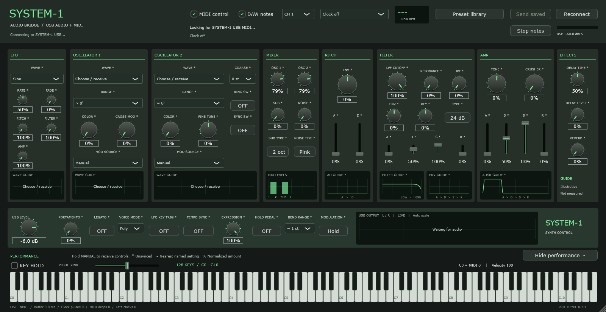

# SYSTEM-1 Audio Bridge

**Roland SYSTEM-1のUSB音声とUSB MIDIをDAWへつなぐ、Windows x64用VST3。** DAWでは普段のオーディオインターフェースを使ったまま、SYSTEM-1のステレオ音声を取り込めます。

[Download v0.7.1](https://github.com/nanikasheila/system1-audio-bridge/releases/tag/v0.7.1) · [English](docs/README.en.md) · [操作ガイド](docs/USER-GUIDE.md) · [ビルド](docs/BUILDING.md)



## できること

- SYSTEM-1 USBステレオ音声の取り込みと、DAWのサンプルレートへの変換
- USB MIDIによる音色編集、DAWノート転送、受信した操作子の反映
- DAWテンポ同期、任意のStart / Stop連動
- Firmware 1.20の12波形、RING / SYNC、Poly / Mono / Unison選択
- プリセットの検索、バンク別表示、お気に入り、名前変更、自作設定の保存
- 全128 MIDIノートの画面鍵盤、折りたたみ、実音スコープ、波形・カーブの参考図

実機が必要です。ソフトウェア音源ではありません。RolandおよびElektronとは関係のない個人開発プロジェクトです。

## インストール

1. [Releases](https://github.com/nanikasheila/system1-audio-bridge/releases)から `SYSTEM-1-Audio-Bridge-v0.7.1-Windows-x64.zip` をダウンロードして展開します。
2. 使用中の旧版プラグインを含むDAWプロジェクトを保存して閉じます。
3. 展開した `VST3` 内の **2つを一緒に**、次のフォルダーへコピーします。

   `%LOCALAPPDATA%\Programs\Common\VST3\System1Bridge`

   ```text
   System1Bridge/
     SYSTEM-1 Audio Bridge.vst3/
     System1Capture.exe
   ```

4. DAWのVST3検索先に上記フォルダーを追加して再スキャンし、インストゥルメントトラックへ追加します。
5. Rolandドライバーを入れたSYSTEM-1をUSB接続します。DAWのオーディオデバイスは普段のRME等のまま使います。

Windows x64とRoland SYSTEM-1ドライバーが必要です。確認環境はWindows 11 / Bitwig Studio 6 / RME Fireface UCX IIです。他のDAWもVST3ホストとして利用する設計ですが、実機検証はBitwigで行っています。バイナリはコード署名していません。

## まず確認すること

- `SYSTEM-1 USB connected` と `USB MIDI ready` が接続の目印です。
- 実機のMANUALを長押しすると現在の操作子を受信できます。`*` は実機と未同期の値です。
- 和音は **VOICE MODE → Poly**。v0.7以前のモード表記の誤りをv0.7.1で修正しました。
- DAWテンポへ追従させる場合は `DAW tempo`、実機のMIDI Clock Sourceは `AUTO` にします。
- 音色変更をDAWプロジェクトから実機へまとめて送るときは `Send saved` を押します。プロジェクト読み込みだけでは一括送信しません。

## プリセットの対応範囲

公式Volume 1〜4、全64 PRMを解析して確認しました。ファイルは同梱していません。[Rolandのサポートページ](https://www.roland.com/jp/support/by_product/system-1/)から入手・展開し、`Preset library → Import folder` で取り込みます。

**公式PRMの読み込みは49項目の部分的なCC変換です。公式音色の完全復元ではありません。** MONO、FILTER TYPE、SUB TYPE、NOISE TYPE、COARSE、BEND RANGEのPRM内表現は未対応です。ARP / SCATTER等も原本保持のみ。これらの実機値は読み込み時に維持されます。PRM原本の書き出しと、自作の `.s1preset` 保存に対応しています。

ライブラリは `%APPDATA%\System1Bridge\Library` に保存します。データを別PCへ移す場合は、このフォルダーもバックアップしてください。

## 現在の制限

- 開発途中のプレリリースです。SYSTEM-1標準音源1台を対象とします。SYSTEM-1m / PLUG-OUT / 他OSは未検証・対象外です。
- ライブ音声を扱うため、高速オフライン書き出しは使用できません。先に音声トラックへ録音してください。
- 約50 msをDAWに遅延として通知します。自動で測定した往復遅延ではありません。
- 1台のMIDI制御を担当できるのは1インスタンスです。
- 波形・エンベロープ・フィルターのGUIDEは模式図です。実機の測定モデルではありません。USB OUTPUTスコープのみ実音です。
- 無音・アクセス失敗時は、デスクトップに音声入力の許可待ちウィンドウが出ていないかも確認してください。

詳しい操作とトラブル対応は[操作ガイド](docs/USER-GUIDE.md)へ。問題報告は[Issues](https://github.com/nanikasheila/system1-audio-bridge/issues)に、DAW・OS・ドライバー・再現手順を添えてください。

## ライセンス

プロジェクトのコードは **AGPL-3.0-only**。JUCEはAGPLv3の条件で使用します。依存ライブラリの著作権と条件は[THIRD-PARTY.md](THIRD-PARTY.md)を参照してください。

リリースには、使用したJUCEの固定版を含む `Source-full.zip` を添付します。GitHubが自動生成するSource code ZIPにはJUCEは含まれませんが、CMakeが固定コミットを取得します。
